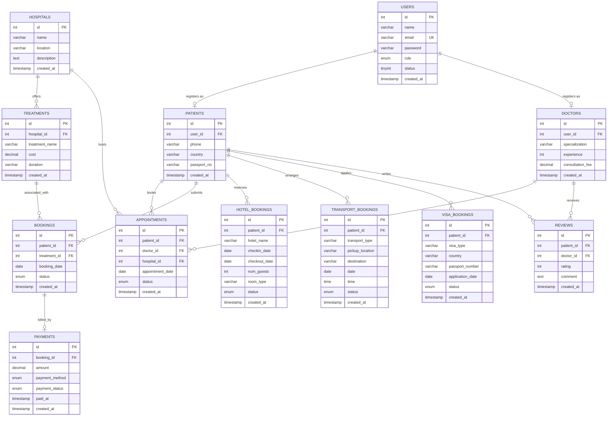

# 🏥 MedTour Services — Medical Tourism Management System

[](https://www.php.net/)
[](https://www.mysql.com/)
[](https://tailwindcss.com/)
[](LICENSE)

MedTour Services is a comprehensive, multi-role web-based application designed to bridge the gap between world-class medical healthcare and international travel support. The system manages the complex lifecycle of medical tourism, combining patient registrations, specialist consultations, hospital bookings, accommodation reservations, transportation scheduling, and visa processing under a unified portal.

---

## 📌 Project Overview

When patients travel abroad for medical treatment, they face logistical hurdles beyond clinical care. MedTour Services solves this by providing:
1. **🏥 Premium Healthcare Coordination:** Seamless appointment booking with specialized doctors at JCI-accredited partner hospitals.
2. **🌍 End-to-End Travel Logistics:** Integrated booking systems for hotel stays, airport/hospital transport, and medical visa processing.
3. **🛡️ Dedicated Portals:** Tailored interfaces for Patients, Doctor Specialists, and System Administrators.

---

## 🛠️ Technology Stack

- **Backend:** PHP 8.x (Session-based auth, prepared SQL statements)
- **Database:** MySQL / MariaDB (Relational structure with cascade triggers)
- **Frontend:** HTML5, Modern Vanilla JavaScript, CSS3
- **CSS Framework:** Tailwind CSS (CDN-based custom theme integration)
- **Typography:** Inter (via Google Fonts)
- **Icons:** SVG icons & Emojis

---

## 🔑 Key Features by User Role

### 1. 🙋‍♂️ Patient Portal
- **Dashboard:** At-a-glance booking metrics for appointments, transport, visas, and hotels.
- **Service Bookings:**
  - **Hospital Booking:** Schedule clinical consultations with specialist doctors.
  - **Hotel Booking:** Find and reserve accommodation close to partner hospitals.
  - **Transportation:** Book airport pickups, private cabs, or medical transport.
  - **Visa Assistance:** Request processing support for medical entry visas.
- **Booking Overview:** Access, review, and track status (`pending`, `confirmed`, `completed`, `cancelled`) for all active bookings.

### 2. 👨‍⚕️ Doctor Portal
- **Professional Overview:** Highlight doctor specialization, experience, and custom consultation fee structures.
- **Appointment Management:** View patient bookings, check patient details, and process appointment statuses.
- **Schedule Tracker:** Keep track of total appointments and upcoming patient check-ups.

### 3. 🛡️ Administrative Portal
- **Logistics Control Center:** Complete oversight of all patient transport requests, hotel bookings, hospital visits, and visa applications.
- **Status Approvals:** Power to change bookings status and process actions.
- **Account Registration:** Provision and register new admin accounts or verify medical doctor profiles.

---

## 📊 Database Schema (ER Diagram)

The system is built on a highly normalized relational database model designed to guarantee data integrity through foreign keys and cascading operations.



---

## 📂 Project Structure

Key files and folders in this repository:

```text
├── index.php                 # Application Main Landing Page
├── services.php              # Public services information page
├── help.php                  # Interactive Help, FAQs, and medical tourism guide
├── nav_bar.php               # Shared navigation layout component
├── mt_db.sql                 # Comprehensive Database schema & sample seed data
│
├── login_user.php            # Patient login portal
├── signup_user.php           # Patient registration portal
├── welcome.php               # Patient dashboard
│
├── login_doctor.php          # Doctor login portal
├── signup_doctor.php         # Doctor registration portal
├── welcome_doctor.php        # Doctor dashboard
├── view_appointments.php     # Doctor appointment tracker list
│
├── login_admin.php           # Admin login portal
├── signup_admin.php          # Admin registration portal
├── welcome_admin.php         # Admin dashboard control center
│
├── hotel.php                 # Hotel booking form
├── transport.php             # Transport booking form
├── hospital.php              # Hospital booking form
├── visa.php                  # Visa assistance form
│
├── submit_hotel.php          # Hotel form submission handler
├── submit_transport.php      # Transport form submission handler
├── submit_hospital.php       # Hospital/Appointment form handler
├── submit_visa.php           # Visa form submission handler
│
├── hotel_bookings.php        # Patient's hotel booking management
├── transport_bookings.php    # Patient's transport booking management
├── visa_bookings.php         # Patient's visa booking management
├── hospital_bookings.php     # Patient's hospital booking management
│
├── view_admin_hotel.php      # Admin view for hotel reservations
├── view_admin_transport.php  # Admin view for transport bookings
├── view_admin_hospital.php   # Admin view for hospital appointments
├── view_admin_visa.php       # Admin view for visa applications
│
├── update.php                # Booking details editor page
├── update_process.php        # Process updates from editor forms
├── delete.php                # Booking cancellation & deletion handler
├── logout_user.php           # Patient session termination
├── logout_doctor.php         # Doctor session termination
└── logout_admin.php          # Admin session termination
```

---

## 🚀 Installation & Setup Guide

To run MedTour Services locally, follow these steps:

### Prerequisites
Make sure you have a local web server environment installed:
- **Windows:** XAMPP or WAMP
- **macOS:** MAMP
- **Linux:** LAMP Stack (Apache, MySQL, PHP)

### Step 1: Clone or Place the Project
Clone this repository or download the source code and place it inside the document root of your local server:
- For XAMPP / LAMPP: `/opt/lampp/htdocs/medtour` or `C:\xampp\htdocs\medtour`

### Step 2: Set Up MySQL Database
1. Start **Apache** and **MySQL** services from your XAMPP/LAMPP control panel.
2. Open your web browser and navigate to **phpMyAdmin** (`http://localhost/phpmyadmin`).
3. Click on the **Databases** tab, enter `mt_db` in the Database name field, and click **Create**.
4. Select the newly created `mt_db` database, click on the **Import** tab.
5. Click **Choose File** and select the database file: `mt_db.sql` located inside the project root folder.
6. Click **Import** (or **Go**) at the bottom to build the schema tables and insert initial rows.

### Step 3: Run the Application
1. Open your web browser.
2. Navigate to: `http://localhost/medtour/index.php`
3. You should see the homepage running with statistics read dynamically from the database.

---

## 💡 Quick Test Guide

1. **Sign Up:** Go to the home page, select "Sign Up" or "Login" to register as a **Patient**, **Doctor**, or **Admin** (via the respective login page links).
2. **Bookings Flow:** Once logged in as a patient, select any service (e.g. transport) and fill in the booking details.
3. **Approval Flow:** Log in as an Administrator (`login_admin.php`) to see the newly submitted booking, update its status, or delete records.

---

## 📄 License

This project is licensed under the MIT License. Feel free to use and adapt this system for educational or real-world project scenarios.
